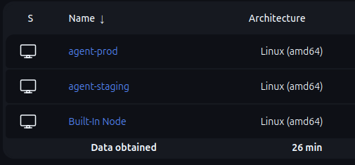
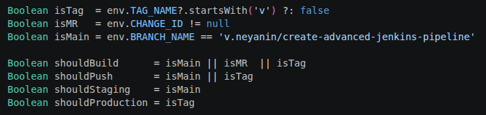
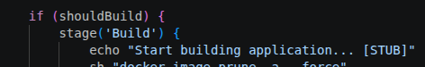
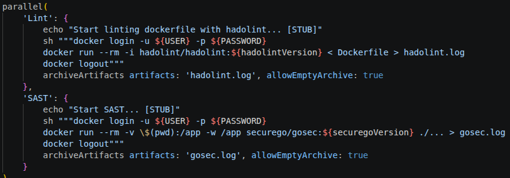
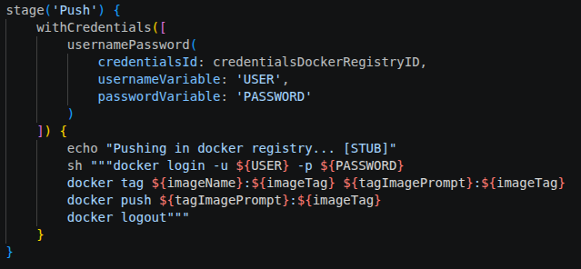
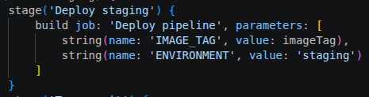
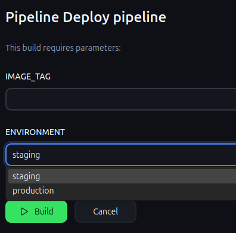
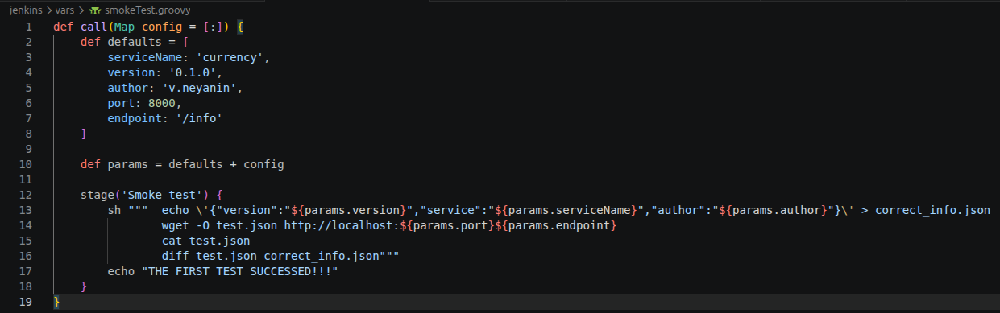
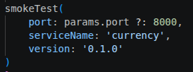
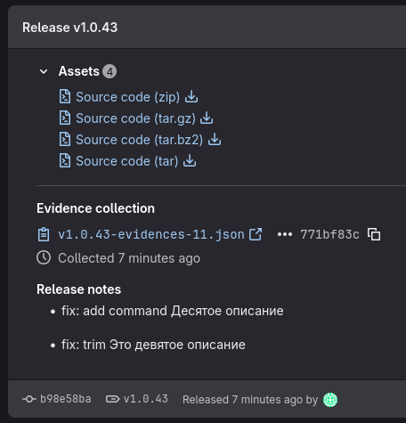

## Отчет о проделанной работе

Постановка задачи:

1. Настроены два агента/раннера для staging и production окружений.
2. Основной пайплайн работает по таблице выше.
3. lint и SAST запускаются параллельно, отчёты сохраняются как артефакты.
4. Образ пушится в registry (DockerHub или GitLab Registry).
5. Параметризованный деплой запускается и вручную, и из основного пайплайна.
6. Smoke-тест после каждого деплоя проходит.

Рассмотрим реализацию каждого пункта по порядку.

1. **Агенты**. Было подключено через SSH 2 агента с тегами staging и production

2. **Основной пайплайн**. В целом решение по логике работы пайплайна повторяет предложенное решение на лекции. В самом начале объявляются логические переменные и потом условия прост проверяют true или false.

3. **Параллельный запуск и артефакты**. Линтил dockerfile, как и в предыдущих дз. Для SAST использовал **контейнер** gosec. Понравилось как это у hadolint сделано и решил не мучаться с контейнером с Go, установкой там gosec и так далее.

4. **Пуш образа**. Как и в прошлом дз, делаю через docker registry. Базовую проблема с исчерпанием количества pull'ов решил с помощью docker login.

5. **Параметризованный деплой**. Реализован запуск из основного пайплайна и вручную. ОН ИСПОЛЬЗУЕТ **Jenkinsfile_deploy**

6. **Smoke-тест**. Его вынес в shared library по пути jenkins/vars/smokeTest.groovy. Особо много не выносил в shared library. smokeTest вынес, так как тесты имеют свойство к изменениям. Условно не /info будет, а /ingormation, или в принципе захочу тестировать /info/currency, то есть полностью логика теста поправить.

Была также реализована одна доп. задача. GitLab Release с changelog по тегу. На деле документация важна. Это позволяет не концентрировать все знания в одном человеке. Идея у меня такая, что берутся заголовки и описания коммитов между нынешним и прошлым тегом, и вставляются в релиз через api. Можно конечно и автора добавить, но вроде не встречал подобное на гитхабе (хотя в рамках компании может оказаться полезным). Вышло не совсем красиво, но так

Если интересно почему выбрал именно это, то скажу, что вообще изначально хотел реализовать как минимум половину допов, но не совсем успел... А красивая документация всегда радует глаз.