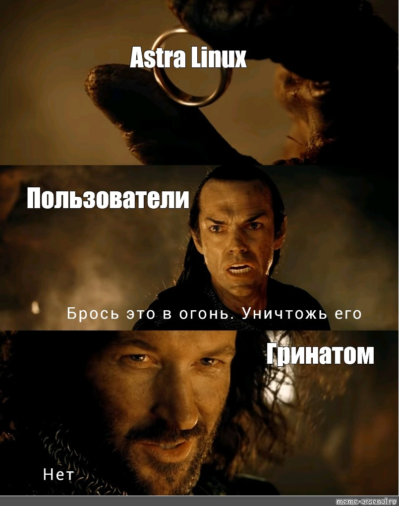
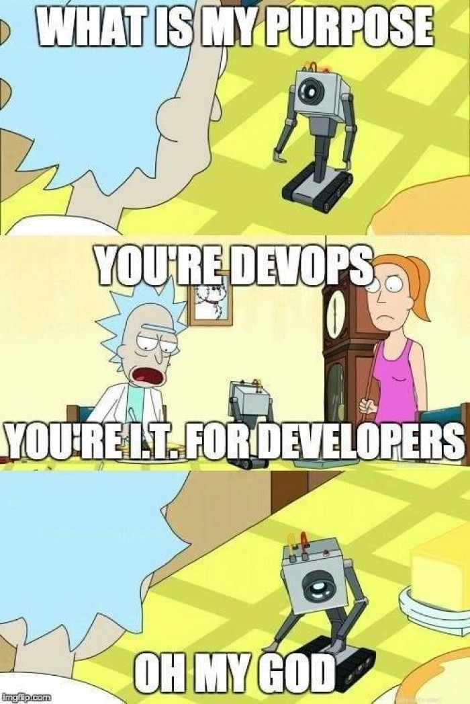
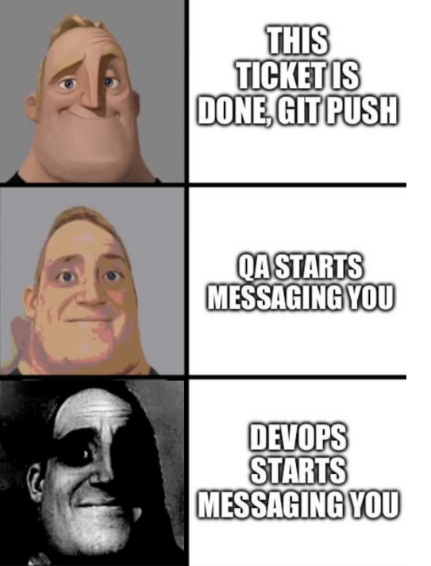

# Доброго дня тем, кто это читает!
## QickStart

Данное приложение запускает сервер, который прослушивает порт из переменной окружения PORT. Обрабатывает GET-запросы **/info** и **/info/currency**.

Модель архитектуры приложения расположена в файле [model.c4](model.c4). Можно быстро просмотреть в [песочнице](https://playground.likec4.dev/) (не мошенники).

**Для начала работы**:
1. Задайте переменную окружения PORT (по умолчанию 8000)
2. Создайте в корне проекта файл .env из примера [.env.example](.env.example) и заполните в нем переменные
3. Установите зависимости и запускайте main.go!
## Вступительное
Надеюсь, что дальнейшая повесть, основанная на реальных событиях, будет краткой и четкой, а читателю не будет овер скучно, если уже не стало🗿

## Хто я, хто мы?
Ну вообще я из Беларуси (да, там где непаханные поля картошки, говорят шуфлядка, смаженка и малако). Бакалавриат окончил по направлению "Прикладная математика и физика" в СПбПУ Петра Великого. В лицейские годы я страстно верил в физику, был олимпиадником по астрономии, ну и как-то верил, что темка нужная. Но еще на втором курсе пришло озарение, что как-то никому это и не надо (по состоянию на 2025 год в Питере было 9 вакансий на hh, куда можно было бы попробовать после моей специальности, причем даже публикацию имею). Потому со второго курса полез в айти.

*Бригада: часть белорусов чет агрятся, если сказать "Белоруссия", основывая тем, что в конституции и всюду написано "Беларусь", ну и в самой стране так никто не говорит
## Войти в айти
Если кратко, то началось все с доп. образования на втором курсе по системному и сетевому администрированию ALtLinux и попытки установить фортран на винду. Фортран стал последней каплей, поставил убунту и боже, sudo apt install gfortran, я был куплен. И простотой системы (бритва Оккама), и свободой, возможностями, просто круть. Получил доп. образование и на третьем курсе пошел работать в универ СыСадмином, и по сей день там (Astra Linux, упаси...)

На работе стараюсь внедрять DevOps, ибо ходить с флешкой и баш-скриптом для раскатки изменений треш. Так за последний год внедрил SaltStack (Ansible нельзя было), ELK (для сбора логов и дашбордов контейнеров), Git (документация, коды). Собственно так я плавно подхожу к DevOps, да. Быть системным администратором как-то слишком скучно... Но бывали задачки по типу написания тг-бота, парсинга xlsx, xsv на питоне и с помощью бд и так далее

Оставалась пролема в том, что я и не особо был разработчиком. Как быть тогда тем, кто сопровождает разработку, если не участвовал в крупных разработках? Так я оказался в магистратуре на "Программной инженерии" в СПбПУ Петра Великого. За первый семестр я успел пройти **практический курс по ручному тестированию схд от ядра**, **попасть в лабораторию Политех-Ядро в команду по автоматизированному тестированию KvadraOS** (дали планшетик, буквально час назад pull request правил), **жоска покодить и набраться знаний** (да, странно это было жирным выделять, но ладно)

## Финалочка
Что ж, если путник (он же читатель) добрался до этого места, то стоит сказать спасибо. Спасибо за внимание! Да, помимо всего выше сказанного люблю спортивные командные игры, фильмы и сериальчики (вчера выкатили трейлер последнего сезона пацанов!), книги (и художку и профессиональную лит-ру), делать чет классное за копейки (и в плане денег, и в плане времени, смекалить в общем).

Хорошего дня!!!

